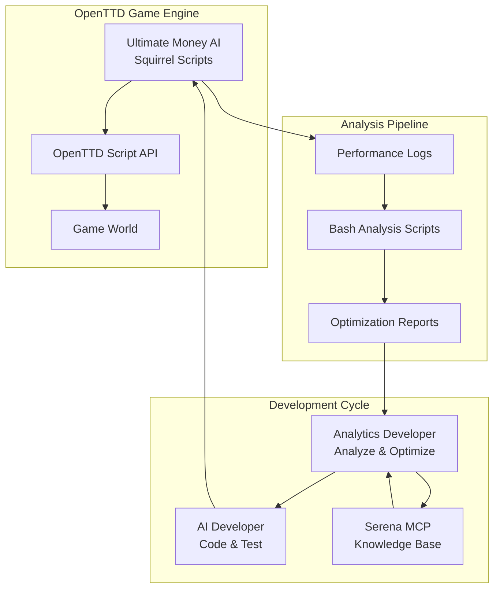
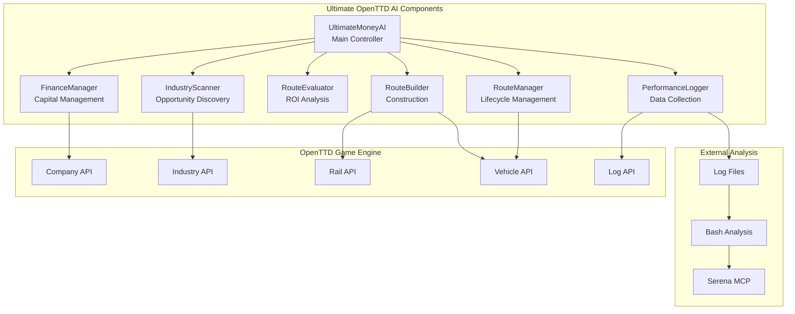
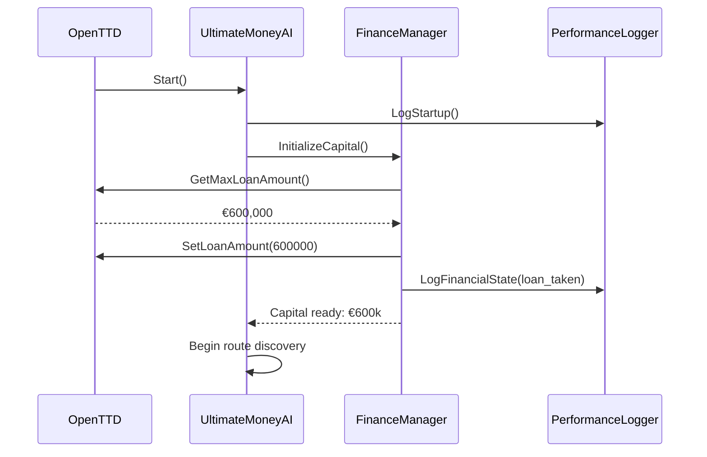
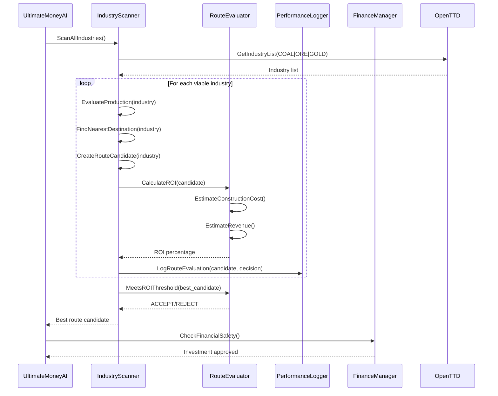
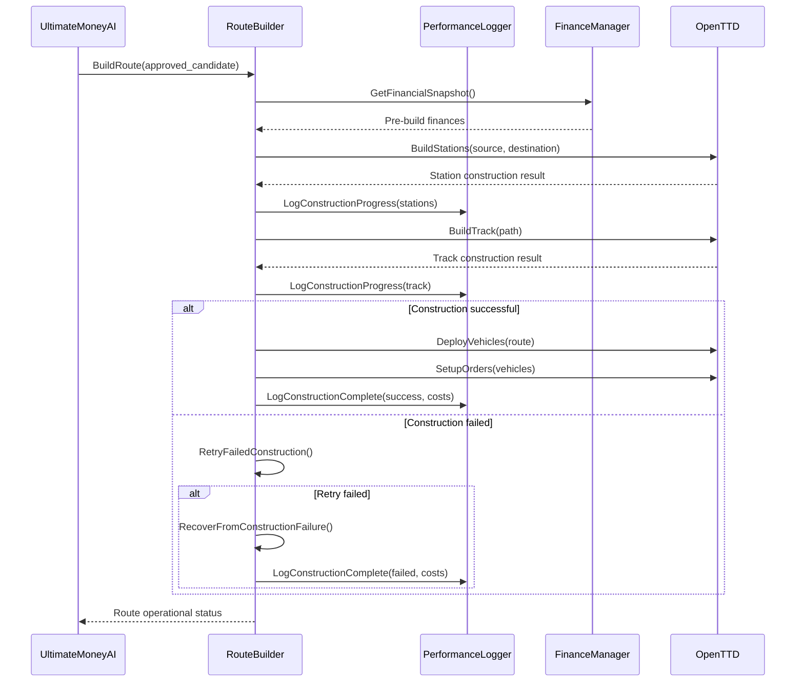
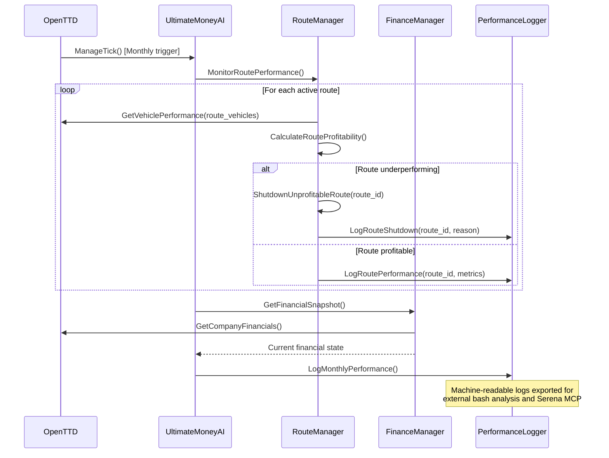

# Ultimate OpenTTD AI Architecture Document

*Version 1.0 - Backend Architecture*  
*Last Updated: 2025-08-20*

---

## Introduction

This document outlines the overall project architecture for Ultimate OpenTTD AI, including backend systems, shared services, and non-UI specific concerns. Its primary goal is to serve as the guiding architectural blueprint for AI-driven development, ensuring consistency and adherence to chosen patterns and technologies.

**Relationship to Frontend Architecture:**
This project operates as an autonomous AI system within OpenTTD with minimal direct user interface requirements. However, development tools, performance monitoring dashboards, and analysis interfaces may require frontend components that will be detailed in a separate Frontend Architecture Document if needed.

### Starter Template or Existing Project

The PRD indicates this is a greenfield OpenTTD AI project with an embedded Squirrel script architecture. The system operates within the existing OpenTTD game engine using:
- **Squirrel 2.2.5 VM** as the runtime environment
- **OpenTTD Script API** for game integration
- **Monorepo structure** containing AI source code, documentation, testing tools, and analysis frameworks

No external starter templates are mentioned, but the project leverages the OpenTTD AI development framework as its foundation. The architecture must work within OpenTTD's constraints:
- 128MB memory limit
- 10,000 operations per execution cycle
- Event-driven execution model
- Embedded script environment

### Change Log

| Date | Version | Description | Author |
|------|---------|-------------|--------|
| 2025-08-20 | 1.0 | Initial architecture document for Ultimate OpenTTD AI | Winston (Architect) |

---

## High Level Architecture

### Technical Summary

The Ultimate OpenTTD AI system follows a **modular embedded script architecture** operating within the OpenTTD game engine. The system uses **Squirrel 2.2.5** for AI logic implementation with comprehensive **performance logging** for systematic optimization. The architecture supports **iterative development cycles** through specialized developer roles (AI Developer vs Analytics Developer) with **knowledge base management** via Serena MCP memory system. The core pattern is **BUILD → TEST → MEASURE → ANALYZE → OPTIMIZE → REPEAT** enabling systematic progression toward theoretical maximum performance in transport network optimization.

### High Level Overview

**Architecture Style:** Embedded Script with External Analysis Pipeline
- **Core AI:** Modular Squirrel scripts within OpenTTD game engine
- **Repository Structure:** Monorepo containing AI code, documentation, logs, and analysis tools
- **Development Model:** Ping-pong iterative development between AI Developer and Analytics Developer roles
- **Knowledge Management:** Persistent learning through Serena MCP memory system
- **Performance Pipeline:** Comprehensive logging → bash analysis scripts → optimization planning

**Primary Flow:**
1. AI Developer implements/optimizes AI logic in Squirrel
2. Manual testing generates performance logs 
3. Analytics Developer extracts metrics and identifies improvements
4. Knowledge base stores successful/failed optimization attempts
5. Next iteration cycle begins with enhanced requirements

**Key Architectural Decisions:**
- **Financial Strategy:** Aggressive €600k loan utilization for rapid expansion
- **Route Focus:** Coal/Ore/Gold train routes with ROI-driven selection
- **Modular Design:** Separate concerns (finance, routing, logging, industry analysis)
- **Comprehensive Logging:** Machine-readable performance data for systematic analysis

### High Level Project Diagram



### Architectural and Design Patterns

**Core Patterns:**

- **Modular Script Architecture:** Separate concerns into finance.nut, route.nut, industry.nut, logger.nut - *Rationale:* Enables focused development and easier maintenance within Squirrel environment

- **Performance Logging Pattern:** Comprehensive machine-readable debug output following standardized specification - *Rationale:* Essential for systematic MEASURE → ANALYZE phases of iterative optimization

- **Iterative Optimization Pattern:** BUILD → TEST → MEASURE → ANALYZE → OPTIMIZE → REPEAT cycle - *Rationale:* Core methodology for achieving theoretical maximum performance through systematic improvement

- **Knowledge Base Pattern:** Persistent storage of optimization attempts, failures, and insights via Serena MCP - *Rationale:* Prevents repeated failed attempts and enables cumulative learning across iterations

- **Role Separation Pattern:** Distinct AI Developer (implementation) vs Analytics Developer (optimization) responsibilities - *Rationale:* Enables specialized expertise and focused development cycles

---

## Tech Stack

### Cloud Infrastructure
- **Provider:** N/A (Local development project)
- **Key Services:** N/A (Self-contained system)
- **Deployment Regions:** Local machine only

### Technology Stack Table

| Category | Technology | Version | Purpose | Rationale |
|----------|------------|---------|---------|-----------|
| **Language** | Squirrel | 2.2.5 | AI script development | Required by OpenTTD, embedded VM environment |
| **Runtime** | OpenTTD Script API | Latest stable | Game integration | Provides all necessary AI capabilities and constraints |
| **Development** | Text Editor | Any | Code editing | Simple editing sufficient for Squirrel scripts |
| **Analysis** | Bash | 4.0+ | Log analysis scripts | Standard Unix tools for performance data extraction |
| **Knowledge Base** | Serena MCP | Current | Persistent memory | Prevents repeated failed optimizations, enables learning |
| **Version Control** | Git | 2.0+ | Code versioning | Track iterations and performance improvements |
| **Testing** | OpenTTD Headless | Latest | Manual test execution | Game engine provides test environment |
| **Log Collection** | Unix Tools | Standard | Performance logging | grep, awk, tee for log processing |

---

## Data Models

### RouteCandidate

**Purpose:** Represents a potential transport route opportunity that the AI evaluates for construction viability and profitability.

**Key Attributes:**
- source_industry: Integer - OpenTTD Industry ID (converted to int for safety)
- destination: Integer - Destination tile index (converted to int)  
- cargo_type: Integer - Cargo type ID (0=Coal, 1=Ore, 2=Gold for simplicity)
- construction_cost: Integer - Total estimated build cost in game currency units
- expected_annual_revenue: Integer - Projected yearly revenue (integer to avoid float precision)
- roi_percentage_x100: Integer - ROI as percentage * 100 (e.g., 15000 = 150.00%)
- distance_tiles: Integer - Manhattan distance between source and destination
- production_capacity: Integer - Source industry monthly production volume

**Relationships:**
- Simple integer references to OpenTTD entities
- No complex nested objects or floating point calculations

### FinancialSnapshot

**Purpose:** Simplified financial state tracking with minimal object overhead.

**Key Attributes:**
- company_value: Integer - Total company valuation in game currency
- bank_balance: Integer - Current cash reserves
- loan_amount: Integer - Outstanding debt to bank
- month_year: Integer - Packed date for simple tracking (YYYYMM format)

**Relationships:**
- Single snapshot object, no historical arrays stored in memory
- Historical data exported to logs for external analysis

### RouteData

**Purpose:** Minimal operational data for active routes only.

**Key Attributes:**
- route_id: Integer - Simple numeric identifier
- monthly_profit: Integer - Last month's profit/loss
- active: Boolean - Whether route is still operational
- vehicle_count: Integer - Number of vehicles assigned

**Relationships:**
- No complex performance tracking in memory
- Detailed metrics exported via logging system only

---

## Components

### UltimateMoneyAI (Main Controller)

**Responsibility:** Central AI coordination and execution cycle management within OpenTTD's event-driven framework.

**Key Interfaces:**
- `Start()` - Initialize AI with aggressive financial strategy
- `ManageTick()` - Main execution loop called by OpenTTD
- `Save()` / `Load()` - Handle game save/load persistence
- `HandleGameLoad()` - Restore AI state after game reload
- `HandleEmergencyShutdown()` - Safe shutdown when critical errors occur
- `CheckOperationLimits()` - Monitor performance and prevent overload

**Dependencies:** All other components, PerformanceLogger

**Technology Stack:** Squirrel 2.2.5, OpenTTD Script API

### FinanceManager

**Responsibility:** Aggressive capital management, loan utilization, and bankruptcy prevention safety checks.

**Key Interfaces:**
- `InitializeCapital()` - Take maximum €600k loan and setup investment budget
- `CheckFinancialSafety()` - Ensure minimum cash reserves maintained
- `CalculateAvailableInvestment()` - Determine budget for new route construction
- `GetFinancialSnapshot()` - Return current FinancialSnapshot data model
- `HandleBankruptcyThreat()` - Emergency financial recovery procedures
- `OptimizeLoanManagement()` - Adjust debt levels based on performance

**Dependencies:** OpenTTD Company API

**Technology Stack:** Squirrel financial calculations using integer arithmetic

### IndustryScanner

**Responsibility:** Systematic discovery and evaluation of coal/ore/gold mining opportunities with competitive awareness.

**Key Interfaces:**
- `ScanAllIndustries()` - Find and catalog all relevant mines
- `EvaluateProduction(industry_id)` - Check monthly production levels
- `FindNearestDestination(industry_id, cargo_type)` - Locate accepting towns/facilities
- `CreateRouteCandidate(industry_id)` - Generate RouteCandidate data model
- `AnalyzeCompetitors()` - Check competitor presence in markets
- `DetectMarketSaturation(industry_id)` - Identify oversupplied routes
- `FindSubsidies()` - Locate available subsidy opportunities (Phase 2+)

**Dependencies:** OpenTTD Industry API, Tile API, Company API

**Technology Stack:** OpenTTD AIIndustryList, AITile operations, competitive analysis

### RouteEvaluator

**Responsibility:** ROI-driven route analysis and construction decision making with data validation.

**Key Interfaces:**
- `CalculateROI(route_candidate)` - Compute ROI percentage using integer math
- `EstimateConstructionCost(source, destination)` - Predict build expenses
- `EstimateRevenue(production, cargo_type, distance)` - Project annual income
- `MeetsROIThreshold(roi_percentage_x100)` - Check against 15000 (150%) minimum
- `ValidateRouteData(route_candidate)` - Ensure data integrity
- `EvaluateSubsidyRoutes(subsidy_list)` - Analyze bonus route opportunities
- `VerifyCalculations(route_candidate)` - Double-check critical math

**Dependencies:** RouteCandidate data model, OpenTTD pathfinding API

**Technology Stack:** Integer-based calculations, terrain analysis via OpenTTD API

### RouteBuilder

**Responsibility:** Physical construction and lifecycle management of rail infrastructure.

**Key Interfaces:**
- `BuildRoute(route_candidate)` - Construct complete rail line
- `BuildStations(source_tile, destination_tile)` - Create cargo stations
- `BuildTrack(path)` - Lay rail track between points
- `DeployVehicles(route_id)` - Purchase and assign trains
- `SetupOrders(vehicle_id, route_data)` - Configure automated transport cycle
- `RetryFailedConstruction(route_id)` - Attempt construction recovery
- `RecoverFromConstructionFailure(route_id)` - Handle build failures gracefully
- `ReplaceVehicles(route_id)` - Update aging or broken vehicles

**Dependencies:** OpenTTD Rail API, Vehicle API, Order API

**Technology Stack:** OpenTTD construction commands, error handling and retry logic

### RouteManager

**Responsibility:** Ongoing route performance monitoring and lifecycle management.

**Key Interfaces:**
- `MonitorRoutePerformance()` - Track active route profitability
- `ShutdownUnprofitableRoute(route_id)` - Abandon failing routes
- `UpgradeRoute(route_id)` - Improve existing infrastructure
- `ManageMultipleRoutes()` - Coordinate portfolio of 3-5 routes (Phase 2+)
- `OptimizeVehicleUtilization(route_id)` - Adjust capacity and scheduling
- `ValidateRouteIntegrity(route_id)` - Check for infrastructure problems

**Dependencies:** RouteData models, OpenTTD Vehicle/Infrastructure APIs

**Technology Stack:** Route performance tracking, vehicle management

### PerformanceLogger

**Responsibility:** Comprehensive machine-readable logging with data validation.

**Key Interfaces:**
- `LogStartup()` - Financial baseline and environment initialization
- `LogRouteEvaluation(route_candidate, decision)` - Route analysis details
- `LogConstructionProgress(route_id, costs)` - Build phase tracking
- `LogMonthlyPerformance()` - Financial and operational summaries
- `LogAnnualSummary()` - Yearly growth and competitive analysis
- `LogErrorRecovery(error_type, action_taken)` - Document problem resolution
- `SanitizeLogData(data)` - Ensure no invalid characters in logs
- `ValidateLogFormat(entry)` - Check standardized format compliance

**Dependencies:** All data models, OpenTTD logging API

**Technology Stack:** AILog.Info() with standardized format strings and validation

### Component Diagrams



---

## External APIs

Based on the PRD requirements and component design, this project operates entirely within the OpenTTD game environment using the built-in Script API. The system does not require external web service integrations.

**No External APIs Required**

The Ultimate OpenTTD AI system is completely self-contained within the OpenTTD game engine. All necessary functionality is provided by:

- **OpenTTD Script API** - Complete game integration for AI operations
- **Serena MCP** - Knowledge base management (local system integration)
- **Local File System** - Log file storage and bash script analysis

**Internal API Dependencies:**

The AI relies exclusively on OpenTTD's comprehensive Script API which provides all necessary capabilities:
- Company management (finances, loans, vehicles)
- Industry scanning and cargo handling
- Rail construction and infrastructure management
- Tile analysis and pathfinding
- Vehicle orders and automation
- Competitive analysis and market data

---

## Core Workflows

### AI Initialization and Capital Deployment



### Route Discovery and ROI-Based Selection



### Route Construction and Vehicle Deployment



### Monthly Performance Monitoring and Analysis



---

## Database Schema

The Ultimate OpenTTD AI system does not use traditional external databases. Instead, it works within OpenTTD's embedded environment using Squirrel's native data structures and relies on external log files for persistent data storage.

### Data Storage Architecture

**In-Memory Structures (Squirrel Tables/Arrays):**
```squirrel
// Financial state tracking
financial_state <- {
    company_value = 0,
    bank_balance = 0, 
    loan_amount = 0,
    month_year = 0  // YYYYMM format
}

// Active route tracking
active_routes <- [
    {
        route_id = 1,
        monthly_profit = 0,
        active = true,
        vehicle_count = 0
    }
    // Additional routes...
]

// Route candidate evaluation cache
route_candidates <- [
    {
        source_industry = 0,      // Industry ID
        destination = 0,          // Tile index
        cargo_type = 0,           // 0=Coal, 1=Ore, 2=Gold
        construction_cost = 0,
        expected_annual_revenue = 0,
        roi_percentage_x100 = 0,  // ROI * 100 for integer precision
        distance_tiles = 0,
        production_capacity = 0
    }
    // Additional candidates...
]
```

### Persistent Storage Strategy

**Log-Based Persistence:**
- **Performance Logs:** Machine-readable debug output in standardized format
- **Configuration Files:** Simple text files for AI parameters and thresholds
- **Serena MCP Memory:** External knowledge base for optimization history

**File Storage Locations:**
```
docs/iteration_logs/
├── iteration-01-YYYYMMDD-HHMMSS.log    # Complete performance data
├── iteration-02-YYYYMMDD-HHMMSS.log    # Subsequent test runs
└── analysis-results/                    # Bash script outputs

.serena/
├── optimization_attempts.md             # MCP memory files
├── failed_optimizations.md
├── parameter_experiments.md
└── strategic_decisions.md
```

### Data Integrity Approach

**No ACID Transactions:** Squirrel environment doesn't support database transactions
**Validation Strategy:** Input sanitization and data type verification before processing
**Recovery Method:** Rebuild state from OpenTTD API calls after game load
**Backup Strategy:** All critical data flows through comprehensive logging system

---

## Source Tree

```
OpenTTD/
├── ai/ultimate-money-ai/               # Core AI implementation
│   ├── info.nut                        # AI metadata and registration
│   ├── main.nut                        # UltimateMoneyAI main controller
│   ├── finance.nut                     # FinanceManager component
│   ├── industry.nut                    # IndustryScanner component
│   ├── route.nut                       # RouteEvaluator component
│   ├── builder.nut                     # RouteBuilder component
│   ├── manager.nut                     # RouteManager component
│   ├── logger.nut                      # PerformanceLogger component
│   ├── utils.nut                       # Utility functions and helpers
│   └── README.txt                      # AI description and version info
│
├── docs/                               # Complete documentation
│   ├── ultimate-openttd-ai-prd.md     # Product requirements
│   ├── architecture.md                # This architecture document
│   ├── ai-strategy/                   # Implementation guides
│   │   ├── ultimate-ai-development-strategy.md
│   │   ├── iterative-workflow.md
│   │   ├── ai-developer-guide.md
│   │   ├── analytics-developer-guide.md
│   │   ├── performance-logging-spec.md
│   │   ├── test-execution-guide.md
│   │   ├── development-environment.md
│   │   ├── developer-handoff-protocol.md
│   │   ├── brainstorming-session-results.md
│   │   └── squirrel225.chm
│   └── iteration_logs/                # Performance test data
│       ├── iteration-01-YYYYMMDD-HHMMSS.log
│       ├── iteration-02-YYYYMMDD-HHMMSS.log
│       └── analysis-results/          # Bash script outputs
│
├── scripts/                           # Analysis and testing tools
│   ├── run-ai-test.sh                 # Automated test execution
│   ├── analyze-logs.sh                # Performance metric extraction
│   ├── extract-metrics.sh             # Detailed data analysis
│   └── test-scenarios/                # Standardized test save games
│       ├── TestAI.sav                 # Basic profitability test
│       ├── Competition.sav            # Multi-AI competitive test
│       └── Subsidy.sav                # Advanced feature test
│
├── .serena/                           # Serena MCP knowledge base
│   ├── optimization_attempts.md       # Complete attempt history
│   ├── failed_optimizations.md        # Anti-pattern database
│   ├── parameter_experiments.md       # Parameter tuning history
│   ├── strategic_decisions.md         # Decision rationale archive
│   ├── iteration_patterns.md          # Cross-iteration patterns
│   └── competitive_analysis.md        # Market intelligence
│
├── .bmad-core/                        # BMad framework files
│   ├── core-config.yaml              # Project configuration
│   ├── tasks/                         # Workflow definitions
│   ├── templates/                     # Document templates
│   └── data/                          # Reference data
│
├── .git/                              # Version control
├── .gitignore                         # Ignore patterns
├── README.md                          # Project overview
└── CHANGELOG.md                       # Version history
```

---

## Infrastructure and Deployment

Since this is a private local development project without cloud infrastructure needs, the deployment architecture focuses on local development workflow and iteration management.

### Infrastructure as Code
- **Tool:** N/A (Local development)
- **Location:** N/A
- **Approach:** Direct file system management and version control

### Deployment Strategy
- **Strategy:** Local manual deployment
- **CI/CD Platform:** N/A (Private project)
- **Pipeline Configuration:** Manual testing workflow via bash scripts

### Environments

- **Development:** Local OpenTTD installation with AI development folder
- **Testing:** Same local environment with standardized test scenarios
- **Production:** Player's OpenTTD game with deployed AI

### Environment Promotion Flow

```
Development → Testing → Production
     ↓           ↓          ↓
Edit .nut → Run tests → Copy to game
   files      Extract     AI folder
              metrics
```

### Rollback Strategy

- **Primary Method:** Git version control with tagged releases
- **Trigger Conditions:** Performance regression, critical bugs, bankruptcy in testing
- **Recovery Time Objective:** Immediate (git checkout previous version)

---

## Error Handling Strategy

### General Approach
- **Error Model:** Defensive programming with graceful degradation
- **Exception Hierarchy:** Squirrel native error handling with custom error types via tables
- **Error Propagation:** Local error handling with comprehensive logging for analysis

### Logging Standards
- **Library:** OpenTTD AILog.Info() native logging
- **Format:** Standardized format per Performance Logging Specification
- **Levels:** INFO (standard), ALERT (problems), ERROR (critical failures)
- **Required Context:**
  - Correlation ID: Route ID or operation identifier when applicable
  - Service Context: Component name (FINANCE, ROUTE, BUILD, etc.)
  - User Context: N/A (autonomous AI system)

### Error Handling Patterns

#### External API Errors
- **Retry Policy:** 3 attempts with exponential backoff for OpenTTD API failures
- **Circuit Breaker:** Disable problematic routes after 5 consecutive failures
- **Timeout Configuration:** No explicit timeouts (OpenTTD manages execution cycles)
- **Error Translation:** Convert OpenTTD API errors to standard AI decision points

#### Business Logic Errors
- **Custom Exceptions:** Error tables with type, message, and recovery action fields
- **User-Facing Errors:** All errors logged to debug output (no direct user interface)
- **Error Codes:** Standardized prefixes: FIN- (financial), ROUTE- (routing), BUILD- (construction)

#### Data Consistency
- **Transaction Strategy:** No formal transactions; rebuild state from OpenTTD API on errors
- **Compensation Logic:** Reverse construction operations on failure, liquidate failed routes
- **Idempotency:** All operations check current state before executing

---

## Coding Standards

These standards are **MANDATORY** for AI development and will directly control code generation behavior.

### General Principles

#### Memory Efficiency First
- Squirrel 2.2.5 has 128MB memory limit - every allocation counts
- Prefer local variables over class members
- Clear large data structures immediately after use
- Avoid deep object nesting and circular references

#### Performance Within Limits
- Maximum 10,000 operations per execution cycle
- Use early returns to minimize unnecessary computation
- Cache expensive OpenTTD API calls when possible
- Prefer integer arithmetic over floating point

#### Logging Integration
- Every decision point must be logged for analysis
- Use standardized PerformanceLogger format consistently
- Include context data (route_id, industry_id, etc.) in all logs

### Naming Conventions

#### Classes
```squirrel
// PascalCase - Clear, descriptive names
class FinanceManager { }
class RouteEvaluator { }
class PerformanceLogger { }
```

#### Functions and Methods
```squirrel
// camelCase - Verb-based names describing action
function calculateROI(route_candidate) { }
function buildRailTrack(start_tile, end_tile) { }
function logRouteEvaluation(candidate, decision) { }
```

#### Variables
```squirrel
// snake_case - Descriptive, avoid abbreviations
local route_candidate = null;
local roi_percentage_x100 = 0;  // Use _x100 suffix for scaled integers
local construction_cost = 0;
local max_loan_amount = AICompany.GetMaxLoanAmount();
```

#### Constants
```squirrel
// UPPER_SNAKE_CASE - Group related constants
const MIN_ROI_THRESHOLD = 15000;  // 150.00% as integer
const MAX_ROUTE_DISTANCE = 50;
const SAFETY_CASH_RESERVE = 50000;
const LOG_PREFIX_FINANCE = "FIN";
const LOG_PREFIX_ROUTE = "ROUTE";
```

#### Files
```squirrel
// kebab-case with .nut extension
main.nut
finance.nut
route-evaluator.nut
performance-logger.nut
```

### Code Structure

#### File Organization
```squirrel
// 1. Constants at top
const MIN_ROI_THRESHOLD = 15000;

// 2. Class definition
class FinanceManager {
    // 3. Member variables (minimize these)
    safety_reserve = SAFETY_CASH_RESERVE;
    
    // 4. Constructor
    constructor() {
        // Initialize only essential state
    }
    
    // 5. Public methods first
    function initializeCapital() { }
    
    // 6. Private methods last (prefix with _)
    function _validateCashReserves() { }
}
```

#### Function Structure
```squirrel
function calculateROI(route_candidate) {
    // 1. Input validation first
    if (route_candidate == null) {
        PerformanceLogger.logError("ROUTE-001", "Null route candidate");
        return -1;
    }
    
    // 2. Early returns for invalid cases
    if (route_candidate.construction_cost <= 0) {
        return -1;
    }
    
    // 3. Main logic with clear variable names
    local annual_revenue = route_candidate.expected_annual_revenue;
    local operating_costs = _calculateOperatingCosts(route_candidate);
    local net_profit = annual_revenue - operating_costs;
    
    // 4. Result calculation
    local roi_percentage_x100 = (net_profit * 10000) / route_candidate.construction_cost;
    
    // 5. Logging before return
    PerformanceLogger.logRouteEvaluation(route_candidate, roi_percentage_x100);
    
    return roi_percentage_x100;
}
```

### Memory Management

#### Variable Scope
```squirrel
// GOOD - Local variables auto-cleaned
function processRoutes() {
    local route_list = [];  // Will be garbage collected
    // ... process routes
    return result;  // route_list automatically freed
}

// BAD - Class member grows indefinitely
class RouteManager {
    all_routes = [];  // Grows forever, memory leak
}
```

#### Data Structure Cleanup
```squirrel
// GOOD - Clear large structures immediately
function analyzeIndustries() {
    local industry_list = AIIndustryList();
    local candidates = [];
    
    // Process data
    foreach (industry_id, _ in industry_list) {
        // ... analysis
    }
    
    // Clear immediately after use
    industry_list.Clear();
    candidates.clear();
    
    return selected_candidate;
}
```

#### OpenTTD API Efficiency
```squirrel
// GOOD - Cache expensive calls
local max_loan = AICompany.GetMaxLoanAmount();  // Call once
local current_loan = AICompany.GetLoanAmount();

// BAD - Repeated expensive calls
if (AICompany.GetLoanAmount() < AICompany.GetMaxLoanAmount()) {
    AICompany.SetLoanAmount(AICompany.GetMaxLoanAmount());
}
```

### Error Handling

#### Standard Error Pattern
```squirrel
function buildRailStation(tile_location, width, height) {
    // 1. Input validation
    if (!AITile.IsValidTile(tile_location)) {
        PerformanceLogger.logError("BUILD-001", "Invalid tile: " + tile_location);
        return false;
    }
    
    // 2. Pre-condition checks
    if (!AITile.IsBuildable(tile_location)) {
        PerformanceLogger.logError("BUILD-002", "Tile not buildable: " + tile_location);
        return false;
    }
    
    // 3. Attempt operation with error handling
    if (!AIRail.BuildRailStation(tile_location, width, height, AIRail.RAILTRACK_NE_SW)) {
        local error_msg = "Station construction failed: " + AIError.GetLastErrorString();
        PerformanceLogger.logError("BUILD-003", error_msg);
        return false;
    }
    
    // 4. Success logging
    PerformanceLogger.logConstructionSuccess("station", tile_location, _getConstructionCost());
    return true;
}
```

#### Error Code Standards
```squirrel
// Format: COMPONENT-NNN
const ERROR_FIN_INSUFFICIENT_FUNDS = "FIN-001";
const ERROR_ROUTE_INVALID_CANDIDATE = "ROUTE-001";
const ERROR_BUILD_CONSTRUCTION_FAILED = "BUILD-001";
const ERROR_LOG_INVALID_FORMAT = "LOG-001";
```

### Logging Requirements

#### Mandatory Logging Points
```squirrel
// 1. All financial operations
AICompany.SetLoanAmount(600000);
PerformanceLogger.logFinancialTransaction("loan_acquired", 600000);

// 2. All route evaluations
local roi = calculateROI(candidate);
PerformanceLogger.logRouteEvaluation(candidate, roi, roi >= MIN_ROI_THRESHOLD);

// 3. All construction operations
if (buildRailStation(tile, 1, 4)) {
    PerformanceLogger.logConstructionSuccess("station", tile, cost);
} else {
    PerformanceLogger.logConstructionFailure("station", tile, error_code);
}

// 4. Performance milestones
PerformanceLogger.logMonthlyPerformance(current_month, company_value, profit);
```

#### Log Format Consistency
```squirrel
// Use standardized format from PerformanceLogger spec
PerformanceLogger.logRouteEvaluation(
    candidate.source_industry,      // Industry ID
    candidate.destination,          // Tile index
    candidate.cargo_type,          // Cargo type integer
    candidate.construction_cost,    // Cost in euros
    candidate.expected_annual_revenue,  // Revenue projection
    roi_percentage_x100,           // ROI as percentage * 100
    decision_approved              // Boolean approval
);
```

### Performance Optimization

#### Integer Arithmetic
```squirrel
// GOOD - Integer math for precision and speed
local roi_percentage_x100 = (annual_profit * 10000) / construction_cost;
local distance_squared = dx * dx + dy * dy;  // Avoid sqrt when possible

// BAD - Floating point (slower, precision issues)
local roi_percentage = annual_profit.tofloat() / construction_cost.tofloat() * 100.0;
```

#### Loop Optimization
```squirrel
// GOOD - Early termination, minimal work per iteration
function findBestRoute(candidate_list) {
    local best_roi = 0;
    local best_candidate = null;
    
    foreach (candidate in candidate_list) {
        // Skip obviously bad candidates early
        if (candidate.construction_cost > available_budget) continue;
        if (candidate.distance_tiles > MAX_ROUTE_DISTANCE) continue;
        
        local roi = calculateROI(candidate);  // Expensive operation last
        if (roi > best_roi) {
            best_roi = roi;
            best_candidate = candidate;
        }
    }
    
    return best_candidate;
}
```

#### API Call Minimization
```squirrel
// GOOD - Batch API queries
local industry_list = AIIndustryList();
foreach (industry_id, _ in industry_list) {
    if (AIIndustry.GetIndustryType(industry_id) == coal_type) {
        // Process coal industry
    }
}

// BAD - Repeated list creation
for (local i = 0; i < 100; i++) {
    local industry_list = AIIndustryList();  // Expensive repeated call
    // ...
}
```

### Comments and Documentation

#### Function Documentation
```squirrel
/**
 * Berechnet ROI für eine Routenkandidaten in Basispunkten
 * 
 * @param route_candidate RouteCandidate Objekt mit allen erforderlichen Daten
 * @return Integer ROI als Prozentsatz * 100 (z.B. 15000 = 150.00%)
 *         Gibt -1 zurück bei ungültigen Eingaben
 */
function calculateROI(route_candidate) {
    // Implementierung...
}
```

#### Inline Comments
```squirrel
// Verwende Integer-Arithmetik für Präzision (vermeidet Float-Rundungsfehler)
local roi_percentage_x100 = (net_annual_profit * 10000) / construction_cost;

// Prüfe ROI-Schwellwert (15000 = 150.00% Mindest-ROI)
if (roi_percentage_x100 >= MIN_ROI_THRESHOLD) {
    // Route genehmigt für Konstruktion
    return true;
}
```

#### Complex Logic Explanation
```squirrel
// Terrain-Kostenfaktor: Berücksichtigt Steigungen, Wasser und Hindernisse
// Formel: Basiskost * (1 + steigung_faktor + wasser_faktor + hindernis_faktor)
local terrain_multiplier = 1000 + slope_penalty + water_crossing_penalty;
local adjusted_cost = base_construction_cost * terrain_multiplier / 1000;
```

### Security and Safety

#### Input Validation
```squirrel
function transferCargo(source_tile, dest_tile, cargo_amount) {
    // Validiere alle OpenTTD API Eingaben
    if (!AITile.IsValidTile(source_tile) || !AITile.IsValidTile(dest_tile)) {
        return false;
    }
    
    // Validiere Geschäftslogik
    if (cargo_amount <= 0 || cargo_amount > MAX_CARGO_CAPACITY) {
        return false;
    }
    
    // Prüfe Finanzsicherheit vor teuren Operationen
    if (AICompany.GetBankBalance(AICompany.COMPANY_SELF) < SAFETY_CASH_RESERVE) {
        PerformanceLogger.logError("FIN-001", "Insufficient cash reserves");
        return false;
    }
    
    // Sichere Operation durchführen
    return _executeCargoTransfer(source_tile, dest_tile, cargo_amount);
}
```

#### Financial Safety
```squirrel
// Immer Sicherheitsreserven vor großen Ausgaben prüfen
function attemptConstruction(estimated_cost) {
    local current_cash = AICompany.GetBankBalance(AICompany.COMPANY_SELF);
    local post_construction_cash = current_cash - estimated_cost;
    
    if (post_construction_cash < SAFETY_CASH_RESERVE) {
        PerformanceLogger.logError("FIN-002", "Construction would violate safety reserves");
        return false;
    }
    
    return true;  // Safe to proceed
}
```

### Testing Patterns

#### Validation Functions
```squirrel
// Erstelle Validierungsfunktionen für kritische Datenstrukturen
function validateRouteCandidate(candidate) {
    if (candidate == null) return false;
    if (candidate.source_industry <= 0) return false;
    if (candidate.destination <= 0) return false;
    if (candidate.construction_cost <= 0) return false;
    if (candidate.expected_annual_revenue <= 0) return false;
    return true;
}

// Verwende Validierung vor kritischen Operationen
function processRoute(candidate) {
    if (!validateRouteCandidate(candidate)) {
        PerformanceLogger.logError("ROUTE-001", "Invalid route candidate");
        return false;
    }
    
    // Sichere Verarbeitung...
}
```

#### State Verification
```squirrel
// Überprüfe Systemzustand vor kritischen Operationen
function ensureOperationalReadiness() {
    // Finanzielle Bereitschaft
    assert(AICompany.GetBankBalance(AICompany.COMPANY_SELF) >= SAFETY_CASH_RESERVE);
    
    // Systemzustand
    assert(AICompany.ResolveCompanyID(AICompany.COMPANY_SELF) != AICompany.COMPANY_INVALID);
    
    // Logging-System
    assert(PerformanceLogger != null);
    
    return true;
}
```

### File Organization Best Practices

#### Directory Structure
```
ai/ultimate-money-ai/
├── main.nut              // UltimateMoneyAI Hauptcontroller
├── finance.nut           // FinanceManager
├── industry.nut          // IndustryScanner  
├── route.nut             // RouteEvaluator
├── builder.nut           // RouteBuilder
├── manager.nut           // RouteManager
├── logger.nut            // PerformanceLogger
├── utils.nut             // Hilfsfunktionen
└── info.nut              // AI-Metadaten
```

#### Import Organization
```squirrel
// main.nut - Zentrale Importe in logischer Reihenfolge
require("logger.nut");     // Logging zuerst (wird überall verwendet)
require("utils.nut");      // Hilfsfunktionen als nächstes
require("finance.nut");    // Kernkomponenten
require("industry.nut");
require("route.nut");
require("builder.nut");
require("manager.nut");
```

### Standards Enforcement

These standards are **verpflichtend** for all Squirrel code development. They ensure:

- **Speicher-Effizienz** within the 128MB limit
- **Performance** within the 10k operations limit  
- **Wartbarkeit** for iterative development cycles
- **Konsistente Protokollierung** for analysis pipeline
- **Fehlerbehandlung** for robust AI operation

Every code review must validate these standards. Deviations are only allowed with documented justification.

---

## Test Strategy and Standards

### Testing Philosophy
- **Approach:** In-game testing only - no unit tests possible for Squirrel scripts
- **Coverage Goals:** Functional validation through live AI behavior observation  
- **Test Method:** Manual execution in OpenTTD with comprehensive logging

### Test Reality for Squirrel Scripts
**No Traditional Testing Possible:**
- Squirrel 2.2.5 has no unit testing frameworks
- OpenTTD's embedded environment doesn't support automated testing
- No way to mock OpenTTD APIs or game state
- Only validation method: Run AI in actual game and observe behavior

### In-Game Testing Strategy

#### Manual Observation Testing
- **Method:** Load AI in OpenTTD and watch behavior
- **Duration:** 5-year game runs minimum for performance data
- **Validation:** Monitor debug console for correct logging output
- **Success Criteria:** AI doesn't crash, builds routes, avoids bankruptcy

#### Performance Testing  
- **Scope:** Complete AI operation in standardized game scenarios
- **Environment:** Consistent map settings and starting conditions
- **Data Collection:** Performance logs captured via debug output
- **Analysis:** Bash scripts extract metrics from log files

#### Debugging Approach
- **Primary Method:** AILog.Info() debug statements throughout code
- **Error Detection:** Watch for exceptions in debug console
- **Behavioral Validation:** Observe AI construction and financial decisions
- **Performance Tracking:** Monitor company growth vs. competitors

### Test Scenarios
- **Basic Test:** Simple map, no competitors, verify basic functionality
- **Competition Test:** Multiple AIs, measure relative performance
- **Stress Test:** Complex map with difficult terrain and high competition

**Key Point:** Testing = Running the AI in-game and measuring results. No other testing method exists for embedded Squirrel scripts.

---

## Security

Security requirements for the embedded OpenTTD AI system focus on data integrity and safe operation within the game environment.

### Input Validation
- **Validation Library:** Custom Squirrel validation functions
- **Validation Location:** All OpenTTD API data inputs before processing
- **Required Rules:**
  - All OpenTTD API results MUST be validated before use
  - Validate data types and ranges for financial calculations
  - Sanitize all data used in logging to prevent log corruption

### Authentication & Authorization
- **Auth Method:** N/A (embedded single-user system)
- **Session Management:** N/A (no user sessions)
- **Required Patterns:**
  - No authentication required for embedded AI system
  - Access control handled by OpenTTD game engine

### Secrets Management
- **Development:** No secrets required (all data from game engine)
- **Production:** No secrets required (self-contained system)
- **Code Requirements:**
  - No hardcoded configuration values
  - All parameters via game engine or configuration files
  - No sensitive data in logs (only game performance metrics)

### API Security
- **Rate Limiting:** N/A (OpenTTD manages execution cycles)
- **CORS Policy:** N/A (no web interfaces)
- **Security Headers:** N/A (no HTTP communication)
- **HTTPS Enforcement:** N/A (local system only)

### Data Protection
- **Encryption at Rest:** N/A (game performance data only)
- **Encryption in Transit:** N/A (no network communication)
- **PII Handling:** No personal information processed
- **Logging Restrictions:** Only log game state and AI decisions, no personal data

### Dependency Security
- **Scanning Tool:** Manual review of Squirrel code dependencies
- **Update Policy:** Follow OpenTTD stable releases
- **Approval Process:** Manual review of any external Squirrel libraries

### Security Testing
- **SAST Tool:** Manual code review for input validation
- **DAST Tool:** N/A (no external interfaces)
- **Penetration Testing:** N/A (embedded system)

---

## Next Steps

After completing this backend architecture:

### For Development Implementation:
1. **Begin AI Development:** Use the AI Developer Guide with this architecture as reference
2. **Setup Development Environment:** Follow development-environment.md specifications
3. **Implement Components:** Start with FinanceManager and PerformanceLogger for Iteration #1
4. **Execute Testing:** Use test-execution-guide.md procedures with standardized scenarios

### For System Architecture:
1. **Review Architecture Completeness:** Validate all components and interfaces are defined
2. **Setup Knowledge Base:** Initialize Serena MCP memory system for optimization tracking
3. **Prepare Analysis Pipeline:** Create bash scripts for log analysis and metric extraction

### Next Agent Handoffs:
1. **AI Developer:** Begin Iteration #1 implementation using this architecture
2. **Analytics Developer:** Setup analysis tools and knowledge base management

**Architecture Completion:** This document provides the complete technical foundation for implementing the Ultimate OpenTTD AI system with its iterative optimization methodology. All components, interfaces, data models, and workflows are defined to support the BUILD → TEST → MEASURE → ANALYZE → OPTIMIZE → REPEAT cycle.