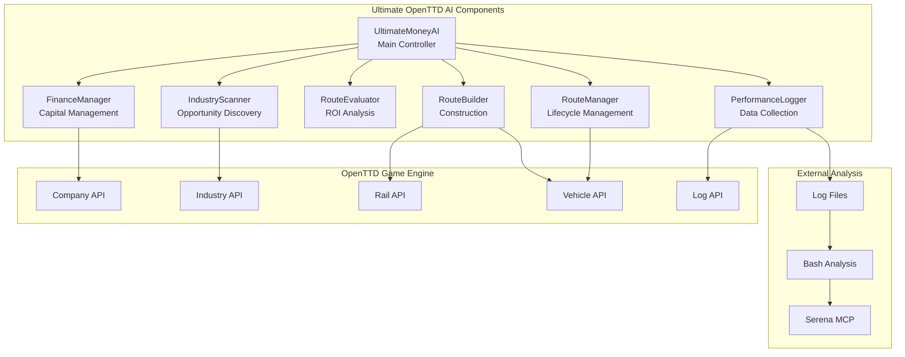

# Components

## UltimateMoneyAI (Main Controller)

**Responsibility:** Central AI coordination and execution cycle management within OpenTTD's event-driven framework.

**Key Interfaces:**
- `Start()` - Initialize AI with aggressive financial strategy
- `ManageTick()` - Main execution loop called by OpenTTD
- `Save()` / `Load()` - Handle game save/load persistence
- `HandleGameLoad()` - Restore AI state after game reload
- `HandleEmergencyShutdown()` - Safe shutdown when critical errors occur
- `CheckOperationLimits()` - Monitor performance and prevent overload

**Dependencies:** All other components, PerformanceLogger

**Technology Stack:** Squirrel 2.2.5, OpenTTD Script API

## FinanceManager

**Responsibility:** Aggressive capital management, loan utilization, and bankruptcy prevention safety checks.

**Key Interfaces:**
- `InitializeCapital()` - Take maximum €600k loan and setup investment budget
- `CheckFinancialSafety()` - Ensure minimum cash reserves maintained
- `CalculateAvailableInvestment()` - Determine budget for new route construction
- `GetFinancialSnapshot()` - Return current FinancialSnapshot data model
- `HandleBankruptcyThreat()` - Emergency financial recovery procedures
- `OptimizeLoanManagement()` - Adjust debt levels based on performance

**Dependencies:** OpenTTD Company API

**Technology Stack:** Squirrel financial calculations using integer arithmetic

## IndustryScanner

**Responsibility:** Systematic discovery and evaluation of coal/ore/gold mining opportunities with competitive awareness.

**Key Interfaces:**
- `ScanAllIndustries()` - Find and catalog all relevant mines
- `EvaluateProduction(industry_id)` - Check monthly production levels
- `FindNearestDestination(industry_id, cargo_type)` - Locate accepting towns/facilities
- `CreateRouteCandidate(industry_id)` - Generate RouteCandidate data model
- `AnalyzeCompetitors()` - Check competitor presence in markets
- `DetectMarketSaturation(industry_id)` - Identify oversupplied routes
- `FindSubsidies()` - Locate available subsidy opportunities (Phase 2+)

**Dependencies:** OpenTTD Industry API, Tile API, Company API

**Technology Stack:** OpenTTD AIIndustryList, AITile operations, competitive analysis

## RouteEvaluator

**Responsibility:** ROI-driven route analysis and construction decision making with data validation.

**Key Interfaces:**
- `CalculateROI(route_candidate)` - Compute ROI percentage using integer math
- `EstimateConstructionCost(source, destination)` - Predict build expenses
- `EstimateRevenue(production, cargo_type, distance)` - Project annual income
- `MeetsROIThreshold(roi_percentage_x100)` - Check against 15000 (150%) minimum
- `ValidateRouteData(route_candidate)` - Ensure data integrity
- `EvaluateSubsidyRoutes(subsidy_list)` - Analyze bonus route opportunities
- `VerifyCalculations(route_candidate)` - Double-check critical math

**Dependencies:** RouteCandidate data model, OpenTTD pathfinding API

**Technology Stack:** Integer-based calculations, terrain analysis via OpenTTD API

## RouteBuilder

**Responsibility:** Physical construction and lifecycle management of rail infrastructure.

**Key Interfaces:**
- `BuildRoute(route_candidate)` - Construct complete rail line
- `BuildStations(source_tile, destination_tile)` - Create cargo stations
- `BuildTrack(path)` - Lay rail track between points
- `DeployVehicles(route_id)` - Purchase and assign trains
- `SetupOrders(vehicle_id, route_data)` - Configure automated transport cycle
- `RetryFailedConstruction(route_id)` - Attempt construction recovery
- `RecoverFromConstructionFailure(route_id)` - Handle build failures gracefully
- `ReplaceVehicles(route_id)` - Update aging or broken vehicles

**Dependencies:** OpenTTD Rail API, Vehicle API, Order API

**Technology Stack:** OpenTTD construction commands, error handling and retry logic

## RouteManager

**Responsibility:** Ongoing route performance monitoring and lifecycle management.

**Key Interfaces:**
- `MonitorRoutePerformance()` - Track active route profitability
- `ShutdownUnprofitableRoute(route_id)` - Abandon failing routes
- `UpgradeRoute(route_id)` - Improve existing infrastructure
- `ManageMultipleRoutes()` - Coordinate portfolio of 3-5 routes (Phase 2+)
- `OptimizeVehicleUtilization(route_id)` - Adjust capacity and scheduling
- `ValidateRouteIntegrity(route_id)` - Check for infrastructure problems

**Dependencies:** RouteData models, OpenTTD Vehicle/Infrastructure APIs

**Technology Stack:** Route performance tracking, vehicle management

## PerformanceLogger

**Responsibility:** Comprehensive machine-readable logging with data validation.

**Key Interfaces:**
- `LogStartup()` - Financial baseline and environment initialization
- `LogRouteEvaluation(route_candidate, decision)` - Route analysis details
- `LogConstructionProgress(route_id, costs)` - Build phase tracking
- `LogMonthlyPerformance()` - Financial and operational summaries
- `LogAnnualSummary()` - Yearly growth and competitive analysis
- `LogErrorRecovery(error_type, action_taken)` - Document problem resolution
- `SanitizeLogData(data)` - Ensure no invalid characters in logs
- `ValidateLogFormat(entry)` - Check standardized format compliance

**Dependencies:** All data models, OpenTTD logging API

**Technology Stack:** AILog.Info() with standardized format strings and validation

## Component Diagrams

---
