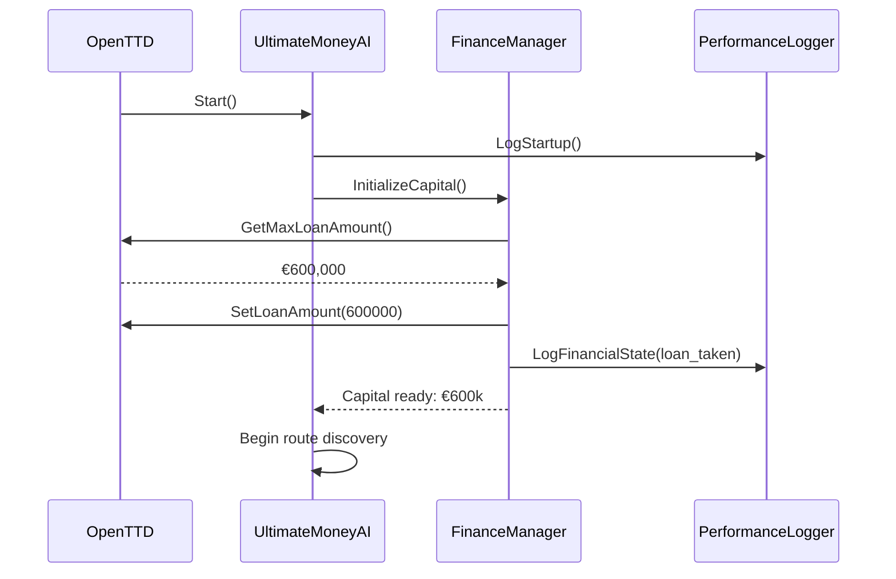
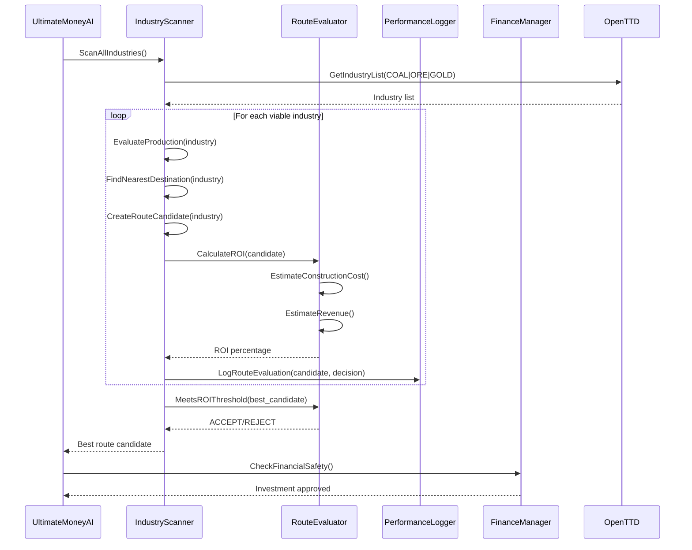
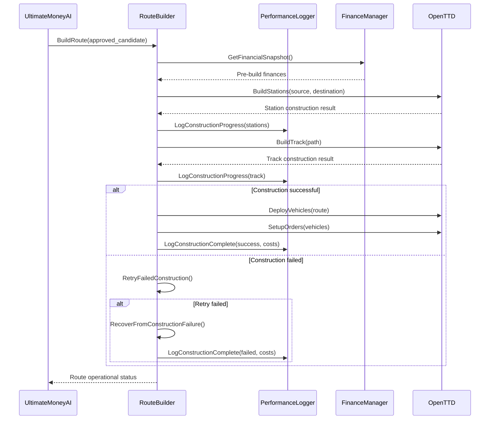
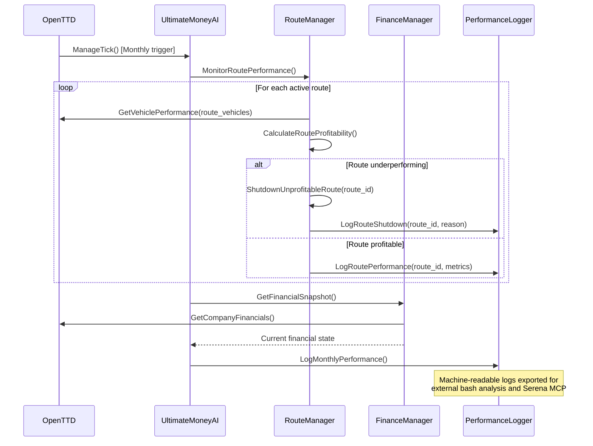

# Core Workflows

## AI Initialization and Capital Deployment

## Route Discovery and ROI-Based Selection

## Route Construction and Vehicle Deployment

## Monthly Performance Monitoring and Analysis

---
