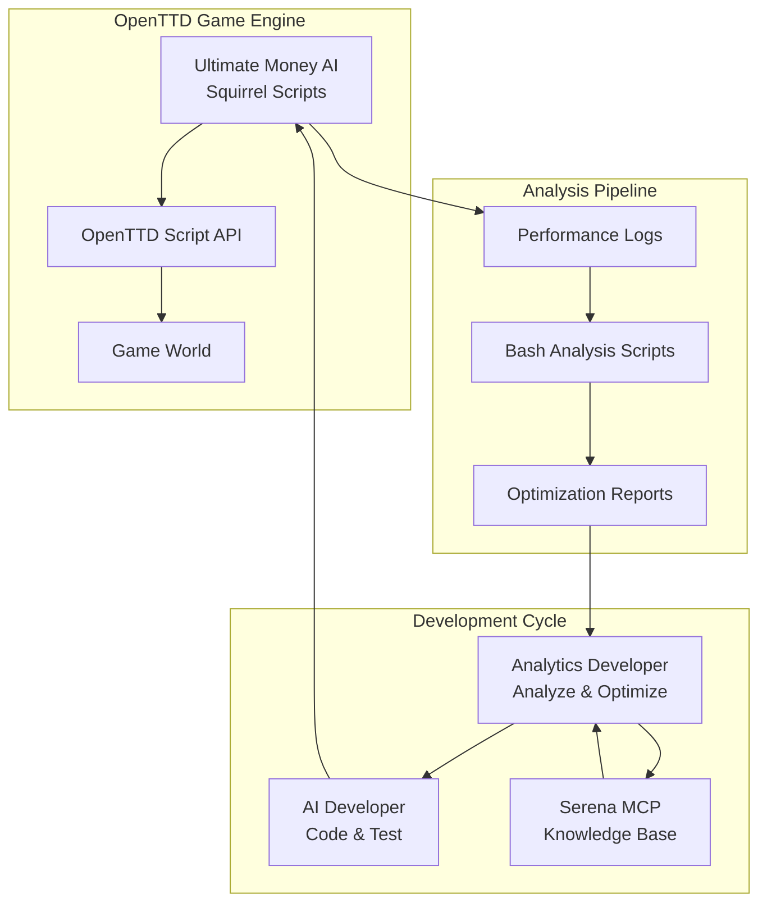

# High Level Architecture

## Technical Summary

The Ultimate OpenTTD AI system follows a **modular embedded script architecture** operating within the OpenTTD game engine. The system uses **Squirrel 2.2.5** for AI logic implementation with comprehensive **performance logging** for systematic optimization. The architecture supports **iterative development cycles** through specialized developer roles (AI Developer vs Analytics Developer) with **knowledge base management** via Serena MCP memory system. The core pattern is **BUILD → TEST → MEASURE → ANALYZE → OPTIMIZE → REPEAT** enabling systematic progression toward theoretical maximum performance in transport network optimization.

## High Level Overview

**Architecture Style:** Embedded Script with External Analysis Pipeline
- **Core AI:** Modular Squirrel scripts within OpenTTD game engine
- **Repository Structure:** Monorepo containing AI code, documentation, logs, and analysis tools
- **Development Model:** Ping-pong iterative development between AI Developer and Analytics Developer roles
- **Knowledge Management:** Persistent learning through Serena MCP memory system
- **Performance Pipeline:** Comprehensive logging → bash analysis scripts → optimization planning

**Primary Flow:**
1. AI Developer implements/optimizes AI logic in Squirrel
2. Manual testing generates performance logs 
3. Analytics Developer extracts metrics and identifies improvements
4. Knowledge base stores successful/failed optimization attempts
5. Next iteration cycle begins with enhanced requirements

**Key Architectural Decisions:**
- **Financial Strategy:** Aggressive €600k loan utilization for rapid expansion
- **Route Focus:** Coal/Ore/Gold train routes with ROI-driven selection
- **Modular Design:** Separate concerns (finance, routing, logging, industry analysis)
- **Comprehensive Logging:** Machine-readable performance data for systematic analysis

## High Level Project Diagram

## Architectural and Design Patterns

**Core Patterns:**

- **Modular Script Architecture:** Separate concerns into finance.nut, route.nut, industry.nut, logger.nut - *Rationale:* Enables focused development and easier maintenance within Squirrel environment

- **Performance Logging Pattern:** Comprehensive machine-readable debug output following standardized specification - *Rationale:* Essential for systematic MEASURE → ANALYZE phases of iterative optimization

- **Iterative Optimization Pattern:** BUILD → TEST → MEASURE → ANALYZE → OPTIMIZE → REPEAT cycle - *Rationale:* Core methodology for achieving theoretical maximum performance through systematic improvement

- **Knowledge Base Pattern:** Persistent storage of optimization attempts, failures, and insights via Serena MCP - *Rationale:* Prevents repeated failed attempts and enables cumulative learning across iterations

- **Role Separation Pattern:** Distinct AI Developer (implementation) vs Analytics Developer (optimization) responsibilities - *Rationale:* Enables specialized expertise and focused development cycles

---
